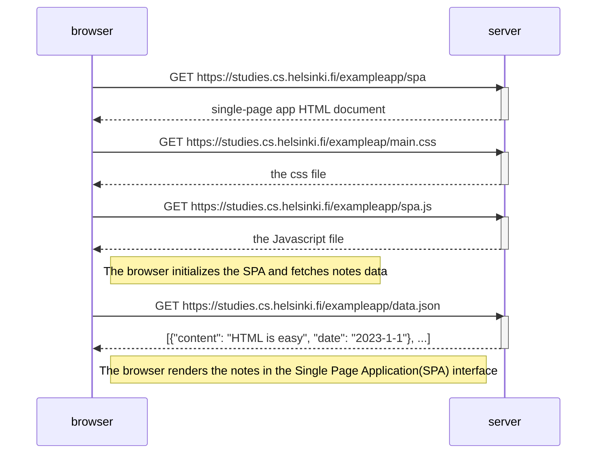

```mermaid
    sequenceDiagram
        participant browser
        participant server

        browser->>server: GET https://studies.cs.helsinki.fi/exampleapp/spa
        activate server
        server-->>browser: single-page app HTML document
        deactivate server

        browser->>server: GET https://studies.cs.helsinki.fi/exampleap/main.css
        activate server
        server-->>browser: the css file
        deactivate server

        browser->>server: GET https://studies.cs.helsinki.fi/exampleapp/spa.js
        activate server
        server-->>browser: the Javascript file
        deactivate server

        Note right of browser: The browser initializes the SPA and fetches notes data
        browser->>server: GET https://studies.cs.helsinki.fi/exampleapp/data.json
        activate server
        server-->>browser: [{"content": "HTML is easy", "date": "2023-1-1"}, ...]
        deactivate server

        Note right of browser: The browser renders the notes in the Single Page Application(SPA) interface 
```