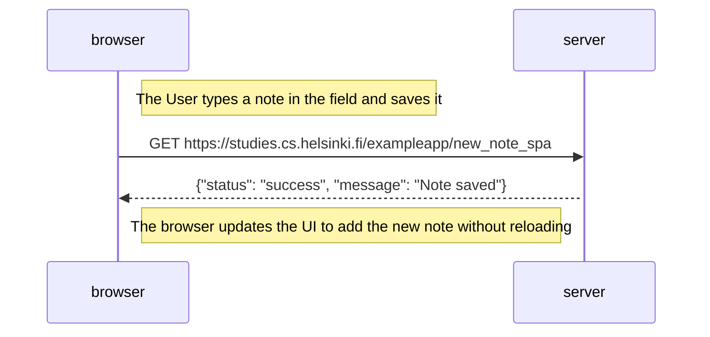

```mermaid
      sequenceDiagram
          participant browser
          participant server

          Note right of browser: The User types a note in the field and saves it
          browser->>server: GET https://studies.cs.helsinki.fi/exampleapp/new_note_spa
          activate server
          server-->>browser: {"status": "success", "message": "Note saved"}

          Note right of browser: The browser updates the UI to add the new note without reloading
```